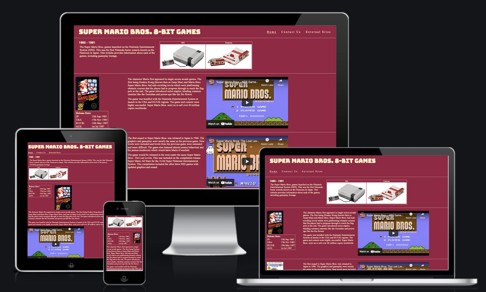

# **_Super Mario Bros. 8-bit games - Project Portfolio 1_**

The purpose of the website is to provide historical information about the Super Mario Bros. games that appeared on the first Nintendo home console. The site also includes video to demonstrate the gameplay of each title. 

## [View website](https://jw-coder84.github.io/CI-Project-Portfolio-1/)

## Objective
To setup a fan site for the early Super Mario Bros. games. The site is intended to be a source of intersting information about the series roots that would appeal to veteran and novice gamers alike. Super Mario Bros. was chosen because of it's popularity and continued success for more than 35 years. The classic games on the site are still enjoyed today, having been made available on various modern Nintendo platforms. The site will demonstrate the use for CSS and HTML, along with the importance of responsive design.

# User Experience (UX)
## Design Prototype

