# **_Super Mario Bros. 8-bit games - Project Portfolio 1_**

The purpose of the website is to provide historical information about the Super Mario Bros. games that appeared on the first Nintendo home console. The site also includes video to demonstrate the gameplay of each title. 

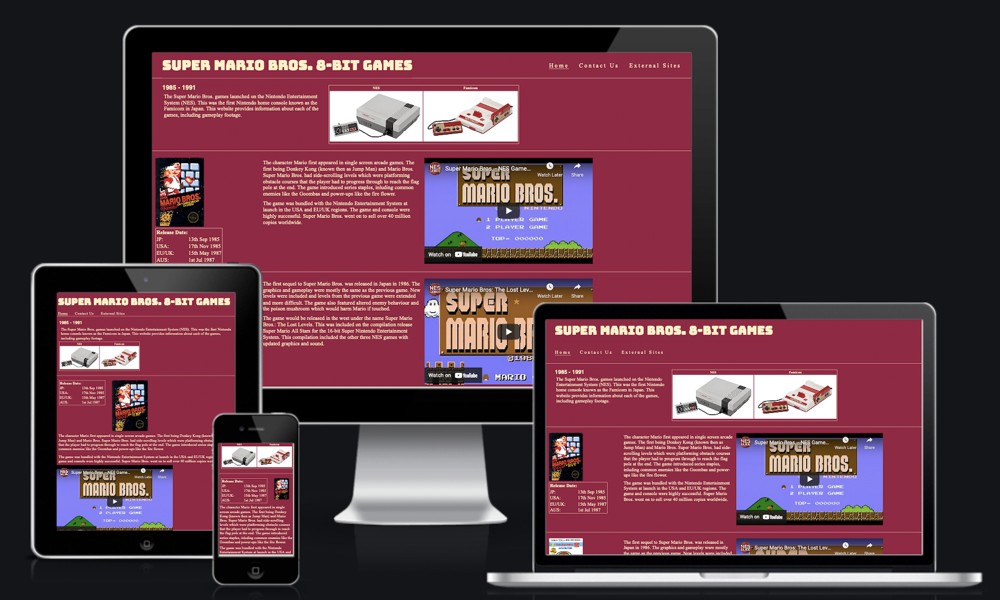

## [View website](https://jw-coder84.github.io/CI-Project-Portfolio-1/)

## Objective
To setup a fan site for the early Super Mario Bros. games. The site is intended to be a source of intersting information about the series roots that would appeal to veteran and novice gamers alike. Super Mario Bros. was chosen because of it's popularity and continued success for more than 35 years. The classic games on the site are still enjoyed today, having been made available on various modern Nintendo platforms. The site will demonstrate the use for CSS and HTML, along with the importance of responsive design.

# User Experience (UX)
## Design Prototype
The wireframe images below were created using Balsamiq Wireframes. Wireframe designs are for desktop, tablet and mobile. I added two images of the console the game appeared on for descorative purposes because landing page looked too plain. My mentor advised me that the site would be better presented with all of the content on one page. The layout of the content across all devices remained the same after it was moved from separate pages onto one. 

### Wireframes

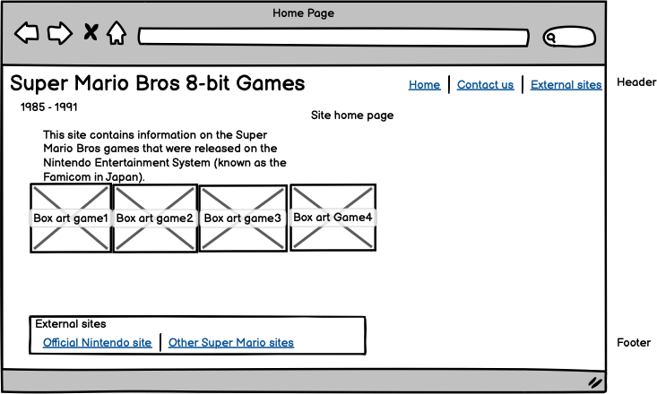
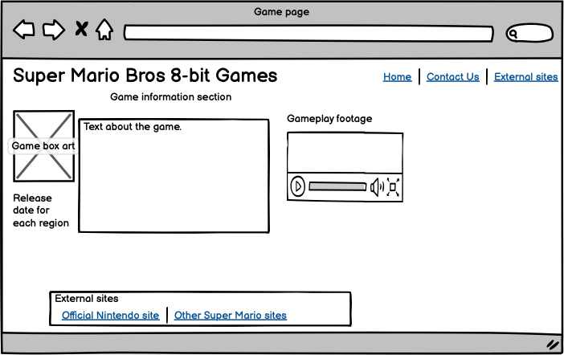
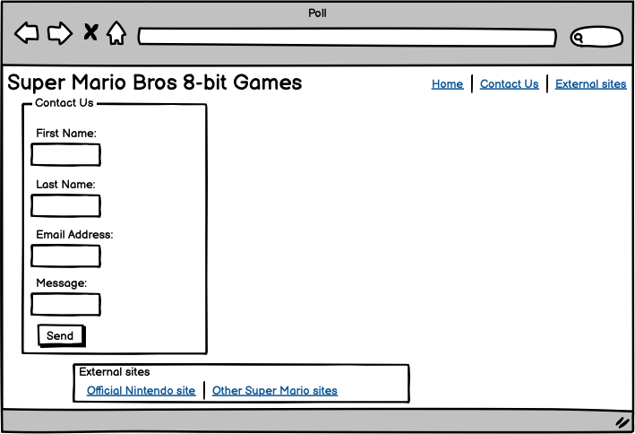
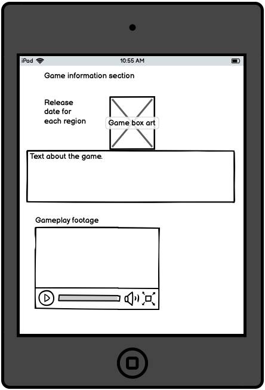
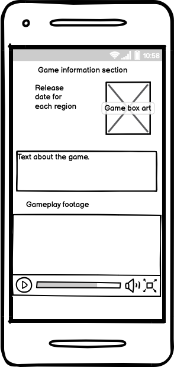

## Site Structure
The site is one page with links to different sections. The links point to the contact form and the links to external sites. These sections can also be accessed by scrolling down the page.

## Design Choices

### Fonts
The google font Bungee was used for the site logo with sans-serif as the alternate if the google font can't be loaded. The default font was used for the rest of the site. 

### Colour Scheme
The colour scheme was chosen to match the colours of the famicom controller shown near the top of the site page. The colours are a close enough match and the contrast was adjusted for clarity. 

* Background colour: #9B1D42
* Text colour: #FBF2C5 

# Features

* The header includes the logo and navigation menu for accessing different sections of the page.
 

<b>Header - logo and navigation image</b>

 

* The site intro immediately informs the user of the sites purpose and the limited scope of the information on the site. Both versions of the console the games appeared on are pictured for decoration.
 

<b>Site intro image</b>

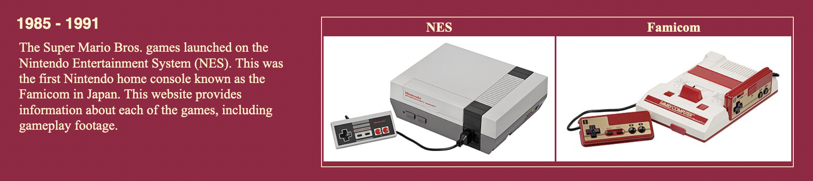

 

* Each game has it's own section clearly divided. Each section contains the games box art, release dates and a video showing gameplay footage.
 

<b>Game info section image</b>

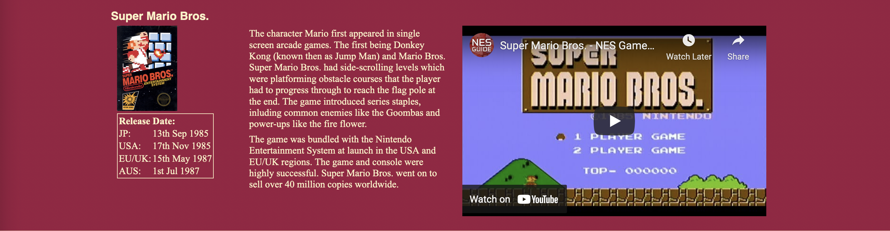

 

* The following section contains a contact form. Clicking the send button triggers an alert, informing the user that their message has been sent. This is to acknowledge that the appropriate action has occurred.
 

<b>Contact form image</b>

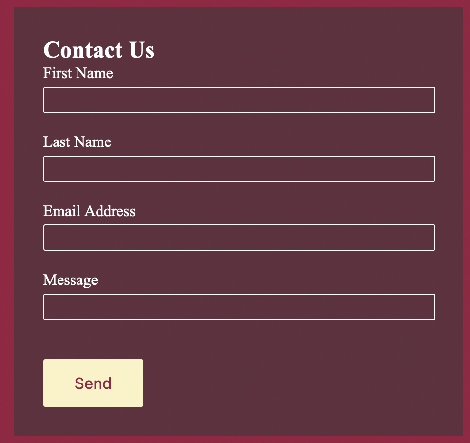

 

* The final section is for the footer which contains links to external Super Mario Bros sites. External links open websites in new tabs.
 

<b>External links image</b>

 
All of the above features are responsive for different screen sizes.

## Future Implementations

* A poll so users can vote for their favourite game.
* Create new sections for future games in the series that appeared on other consoles.
* A section about the people at Nintendo that created the games.
* A ranking list of the best Super Mario games across all consoles.

# Technologies used
* HTML5 - The structure of the site content.
* CSS - The styling and positioning of the content.
* Google Fonts - Font resource used for the logo.
* Balsamiq - Wireframe sofware.
* Github - Version control and host of project file repository.
* Gitpod - Development environment.

# Testing
* Mozilla Firefox browser and it's development tools were used to test the layout of the site on other devices. Was also used to find the cause of issues in the CSS code.
## Code validation
The website HTML and CSS code was validated using tools from W3C.
### HTML
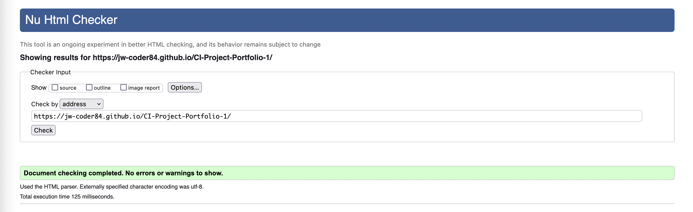

### CSS
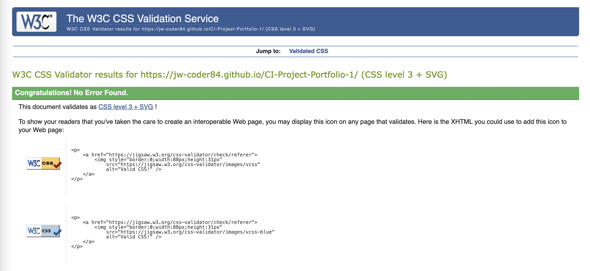

## Issues that were encountered during testing
* I tried to use some code from the love running project for the layout of the game info div elements. This was more than what I needed. It was difficult to adapt. I looked at one of the html lessons from Code Institute and found a solution to line the div elements in a row. This was much more simple and straight forward.
* Centralising the content moved the hr divide lines to the right, leaving a gap on the left side of the page. I wrapped each game info div element in section tags and left the hr tags outside. The hr tags there then unaffected from the centering of the game info content.
* The were lots of adjustments and tweaking of the CSS regarding the positioning and size of the different HTML elements. This was the case for for desktop, tablet and mobile screen sizes.

## HTML Validator issues
* I used header tags for the text in the table header (th) cells. This was flagged as an error because a header element e.g. \<h4\> must not be a descendant of the \<th\> element. I replaced these with strong tags to make the text bold.
* The first row of the release info table had one th cell in one column. The rows below had two td cells in two comlumns. The rows exceeding the column count of the first was flagged as a warning. I added a 'colspan' attribute to the th cell and gave it a value of 2 so the cell would span both of the columns in the rows below.

